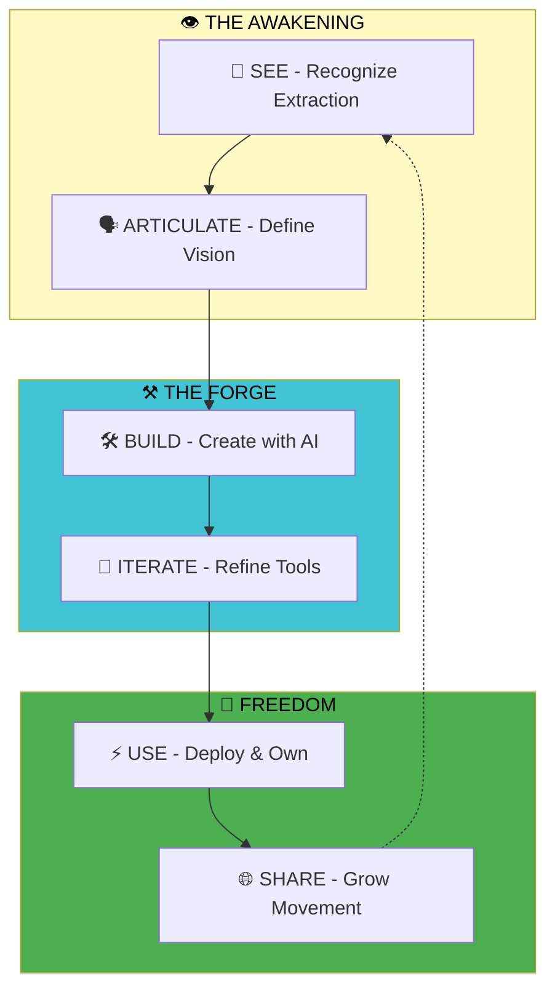

```
╭────────────────────────────────────────────────────────────────────────────╮
│                                                                           │
│        ⛓️  COMING OUT SWINGING  ⛓️                                          │
│                                                                           │
│                  RECLAIM YOUR AGENCY                                      │
│                                                                           │
│     AI is either the final layer of your digital cage,                   │
│     or the wire-cutters that set you free.                                │
│                                                                           │
│                  Choose wisely.                                           │
│                                                                           │
╰────────────────────────────────────────────────────────────────────────────╯
```

# Coming Out Swinging Manifesto

> **Build for Autonomy. Reject the Passive.**

An interactive manifesto and toolkit for reclaiming autonomy through AI-assisted creation and the "See-Articulate-Build-Use" loop.

## 💥 Overview

**Coming Out Swinging** is not just a manifesto—it's a movement. For decades, we've been trapped in "scroll loops" designed to extract our attention. We've been convinced we're consumers when we're actually creators. This tool helps you break free and build the systems you need.

### The Core Philosophy

**OPERATIONAL PHILOSOPHY**: AI is either the final layer of your digital cage, or the wire-cutters that set you free. Choose wisely.
## 🗺️ System Architecture




## 🔄 The Loop

The **See-Articulate-Build-Use** loop is your path to autonomy:

1. **👁️ SEE**: Recognize the extraction happening around you
2. **🗣️ ARTICULATE**: Put your vision into words
3. **⚒️ BUILD**: Use AI to create the tools you need
4. **🚀 USE**: Deploy and iterate on your creations

## 📜 The Four Chapters

### Chapter 01: The Great Extraction
**Seeing the Invisible Chains**

For decades, our attention has been the product. We've been trapped in "Scroll Loops" designed by engineers to keep us passive. The first step is to RECOGNIZE the extraction. You aren't just a user; you are a creator who has been convinced they are a consumer.

### Chapter 02: Articulate the Future
**From Passive to Active**

Once you see the problem, you must articulate what you want to build. This is where most people get stuck—they know what's wrong but can't express what should exist. This chapter teaches you to turn frustration into specification.

### Chapter 03: The Bot Forge
**Building Your AI Assistants**

With AI, you don't need to be a developer to build. You can create bots, workflows, and tools that serve YOUR needs. This isn't about using someone else's product—it's about forging your own.

### Chapter 04: Radical Use-Cases
**Deploy and Iterate**

The final step is deployment. Your tools should work for you, not extract from you. Share your loops with the community, track your autonomy gains, and keep building.

## ✨ Features

### 📜 Progressive Manifesto Reader
- Read through chapters at your own pace
- Interactive, accessible interface
- Neurodivergent-friendly design
- Purple gradient aesthetic

### 🔄 Loop Builder
- Define your personal "See-Articulate-Build-Use" loop
- Document what you can see, articulate, build, and use
- Track your AI-assisted workflows

### 📊 Workflow Visualizer
- Visual representation of your AI-assisted processes
- See how AI helps you reclaim time and autonomy

### 💯 Autonomy Tracker
- Measure how much agency you're reclaiming
- Track time saved, tools built, and loops completed

### 🌐 Community Feed
- Share your loops with others
- Learn from the community
- Build a movement, not just a tool

## 🚀 Live Demo

**Experience it now:** [Coming Out Swinging Manifesto on Google AI Studio](https://aistudio.google.com/apps/drive/1WROh1VJ3JBx0uR3Hg9PMoLQJLuZL6MRn?showPreview=true&showAssistant=true)

## 🎨 Design Philosophy

- **Purple gradient background**: Bold, defiant, memorable
- **Bold typography**: Clear and unapologetic
- **Accessibility-first**: Works for everyone
- **Neurodivergent-friendly**: No barriers to entry

## 🛠️ Technical Stack

- **AI Model**: Gemini 3 Flash Preview
- **Framework**: React + TypeScript
- **Components**:
  - `Layout.tsx` - Main layout wrapper
  - `ManifestoViewer.tsx` - Chapter reader
  - `LoopBuilder.tsx` - Define your loop
  - `WorkflowVisualizer.tsx` - Visual workflow mapping
  - `AutonomyTracker.tsx` - Track your progress
  - `CommunityFeed.tsx` - Community sharing

## 📁 Project Structure

```
coming-out-swinging-manifesto/
├── metadata.json
├── index.html
├── index.tsx
├── types.ts
├── constants.tsx
├── services/
│   └── geminiService.ts
├── components/
│   ├── Layout.tsx
│   ├── ManifestoViewer.tsx
│   ├── LoopBuilder.tsx
│   ├── WorkflowVisualizer.tsx
│   ├── AutonomyTracker.tsx
│   └── CommunityFeed.tsx
└── App.tsx
```

## 💡 Use Cases

### For Creators
- Break free from platform lock-in
- Build tools that serve your needs
- Reclaim time stolen by endless scrolling

### For Builders
- Document your AI-assisted workflows
- Share your automation loops
- Inspire others to build

### For The Curious
- Understand how AI can empower, not extract
- Learn the See-Articulate-Build-Use framework
- Join a movement toward digital autonomy

## 🎯 The Mission

We're building a movement of people who:

1. **See** the systems designed to keep them passive
2. **Articulate** what they want to exist
3. **Build** it with AI assistance
4. **Use** it to reclaim their time and agency

This isn't about rejecting technology—it's about using it on YOUR terms.

## 💬 Manifesto Quotes

> "You aren't just a user; you are a creator who has been convinced they are a consumer."

> "AI is either the final layer of your digital cage, or the wire-cutters that set you free."

> "The first step of Coming Out Swinging is to RECOGNIZE the extraction."

## 🤝 About Turner Works

This manifesto is part of the Turner Works AI portfolio—building tools for autonomy, not extraction.

## 📡 Join The Movement

- Share your loop
- Build your tools
- Reject the passive
- Reclaim your agency

## 📬 Contact

For collaborations, questions, or to share your loop:
- 📧 projects@gmail.com
- 📧 OllieKTurner@gmail.com

## 📝 License

Built with ⛓️ for autonomy and agency.

---

**⚠️ Remember**: Every minute you spend building is a minute you're not being extracted from. Come out swinging. 🔥
